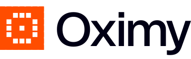

<p align="center">
  
</p>

<h1 align="center">Reality Checks for AI work</h1>

<p align="center">AI can do more every week. The hard part is knowing what happened.</p>

Oximy Reality Checks are ten local-first agent skills for finding out what an AI touched, what humans had to fix, and whether the work actually finished. Each skill answers one concrete question with an evidence ledger, explicit unknowns, and a completion test.

This repository is a private preview. The skills can be reviewed and installed from the repository, but no public marketplace listing has been submitted.

## The ten reality checks

| Skill | The question it answers | Primary input | Required output |
|---|---|---|---|
| `safe-to-paste` | Can I share this with an AI service for this task? | Material, destination, intended task | Sensitivity ledger, redacted copy when requested, residual risk |
| `did-it-land` | Did the agent's claimed result reach durable state? | Completion claim and system of record | Claim-by-claim verdict with independent readback |
| `human-review-tax` | What changed between the AI draft and accepted work? | Comparable initial and final artifacts | Structural diff, correction classes, evidence limits |
| `where-did-my-data-go` | Where did data move during this AI task? | Bounded session traces and configuration | Data-lineage table with lifecycle verbs and confidence |
| `what-does-my-ai-remember` | What reusable memory can this AI access? | Explicit, narrow memory roots | Content-minimized inventory, provenance and staleness review |
| `right-size-my-agent` | Does this agent have more capability than its work needs? | Configuration, task set and traces | Keep/restrict/remove candidates with counterexamples |
| `agent-autopsy` | Where did an agent run first meaningfully diverge? | Session trajectory and intended outcome | Evidence timeline, first consequential divergence, replay plan |
| `skill-sunset` | Should an installed skill be kept, repaired or retired? | Exact skill version and activation evidence | Routing/execution assessment and disposition |
| `bottleneck-shift` | Did AI remove work or move it downstream? | Comparable workflow events before and after | Phase comparison, shifted constraints, bounded next experiment |
| `policy-vs-reality` | Does observed AI use match written policy? | Atomic policy statements and enforcement evidence | Policy-to-practice matrix with explicit gaps |

## Install

The repository is private, so authenticate with GitHub before using a remote install command.

### Skills-compatible agents

```sh
npx skills add OximyHQ/oximy-reality-checks --list
npx skills add OximyHQ/oximy-reality-checks
```

### Claude Code

```sh
claude plugin marketplace add OximyHQ/oximy-reality-checks
claude plugin install oximy-reality-checks@oximy
```

### Codex

```sh
codex plugin marketplace add OximyHQ/oximy-reality-checks
```

Then open the plugin marketplace in Codex and install **Oximy Reality Checks**. Exact install behavior depends on the current client; see [Marketplace readiness](docs/MARKETPLACE.md) for the validation boundary.

## Try one

```text
Use $safe-to-paste to review this customer transcript for a summarization task.
```

```text
Use $did-it-land to verify that this deployment is live, not merely merged.
```

```text
Use $agent-autopsy to find the first consequential divergence in this session.
```

The skill should ask only for evidence that changes the answer. It may run its bundled local helper, but a clean deterministic scan is never treated as proof of safety, causality, quality or completion.

## What makes a Reality Check

Every skill follows the same contract:

1. **Bound the question.** Name the task, time window, artifacts and system of record.
2. **Separate evidence from inference.** Mark facts as supplied, observed, inferred or unknown.
3. **Prefer independent readback.** A tool response or agent claim is not durable state.
4. **Use the right lifecycle verb.** Collected, transmitted, stored, retrieved and reported are different events.
5. **Preserve user authority.** Audits do not delete, revoke, send, publish or modify external state without explicit approval.
6. **Finish visibly.** Each skill defines a required output and an explicit completion criterion.

This collection measures tools, requests, artifacts and completed work. It does not score individual people.

## Local helpers

Each skill includes a small standard-library Python helper for the mechanical part of the investigation: tokenizing obvious secrets, validating an evidence ledger, comparing artifacts, summarizing traces or checking a matrix. Helpers are content-minimizing by default and state what their output cannot prove.

```sh
python3 plugins/oximy-reality-checks/skills/safe-to-paste/scripts/redact_text.py --help
python3 scripts/validate_repository.py
python3 -m unittest discover -s tests -v
```

## How this was researched

The authoring standard was informed by a reproducible structural study of 400 exact-content-deduplicated `SKILL.md` files from 364 GitHub repositories, plus a 185-entry public marketplace snapshot and manual review of strong workflow, diagnosis and architecture skills. We retained source URLs and measurements, not copied skill text.

The study is not a ranking and does not claim that structure proves behavioral quality. Read the [methodology](research/README.md), [findings](research/findings.md), [corpus rows](research/corpus.csv) and [leaderboard snapshot](research/leaderboard.csv).

## Privacy and safety

- Local-first means bundled helpers do not make network requests. The hosting agent may still have network tools; each skill constrains their use.
- Content is excluded from inventory reports unless the user explicitly asks for excerpts.
- Source artifacts are not overwritten.
- Unknown vendor terms, inaccessible stores and unobserved runtime behavior stay unknown.
- High-stakes legal, compliance and security decisions still need the appropriate human owner.

See [PRIVACY.md](PRIVACY.md), [SECURITY.md](SECURITY.md) and [AUTHORING.md](AUTHORING.md).

## Private-preview status

The Codex and Claude marketplace manifests are included and validated locally. Public submission, a public-repository switch and the final license are intentionally withheld until the release package is approved. [docs/MARKETPLACE.md](docs/MARKETPLACE.md) lists the remaining release gates without pretending they have happened.

## Contributing

Start with [CONTRIBUTING.md](CONTRIBUTING.md). A new check needs a narrow trigger, a non-goal, an evidence model, a deterministic aid where one is useful, adversarial eval cases and a completion test. A clever prompt is not enough.

